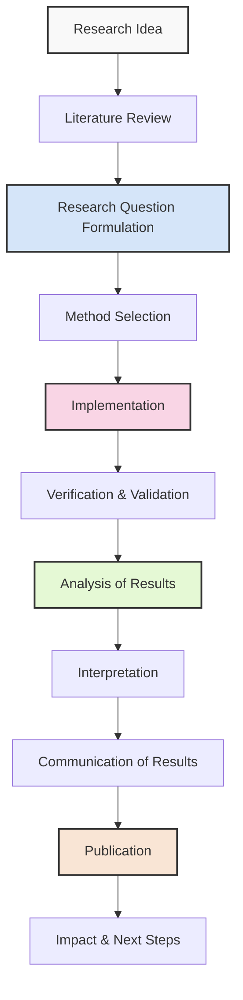
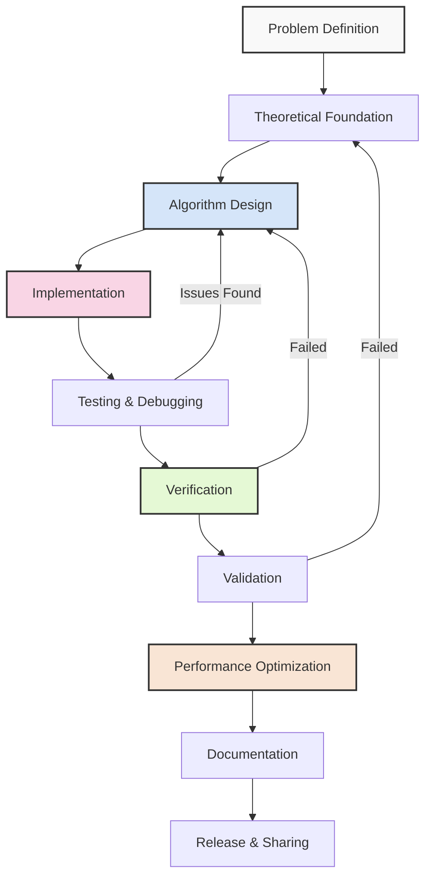
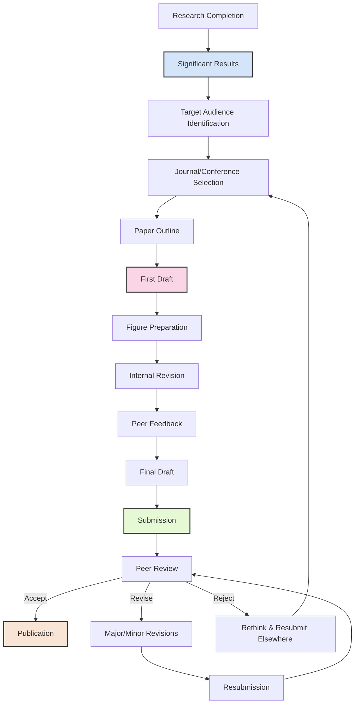
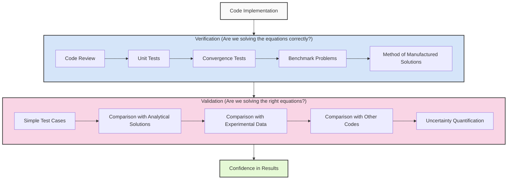
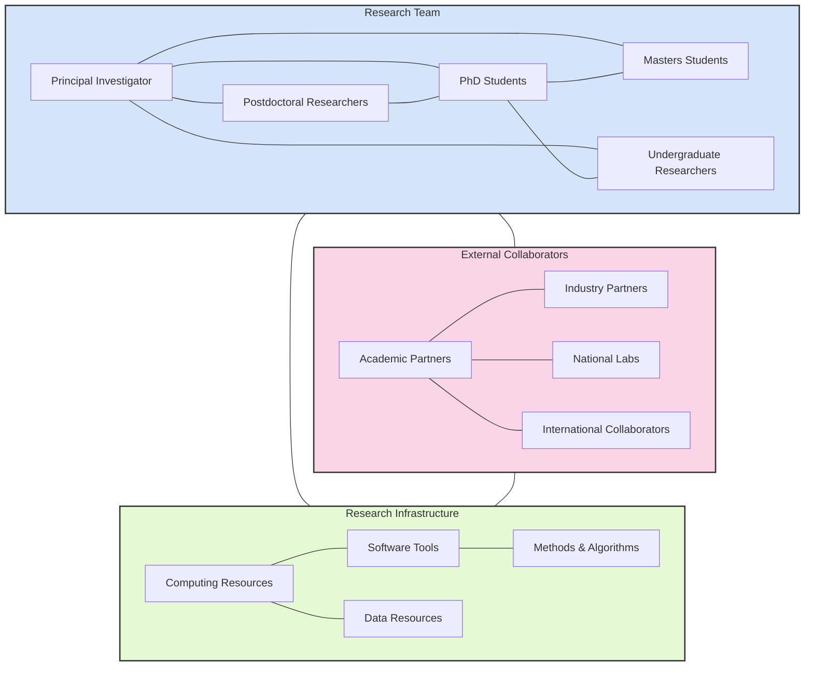
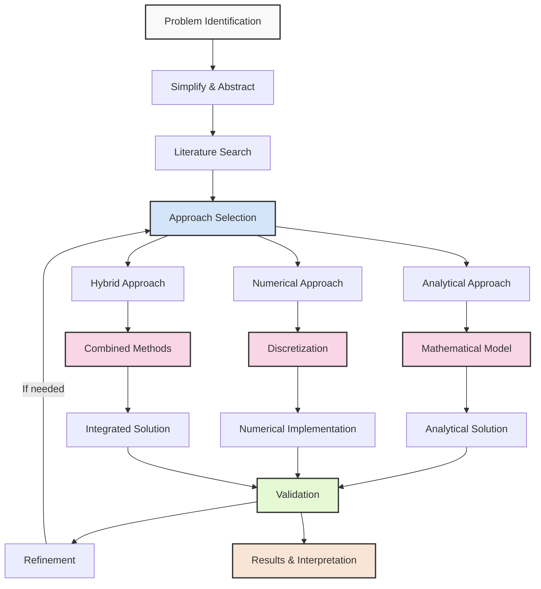
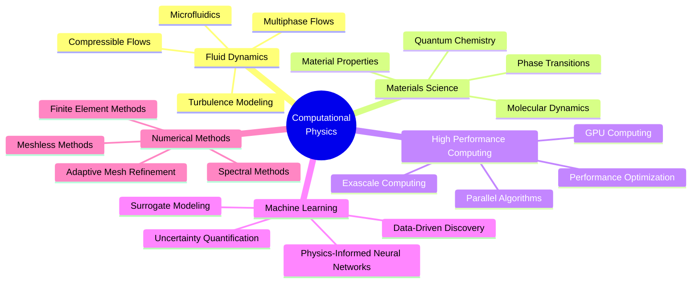
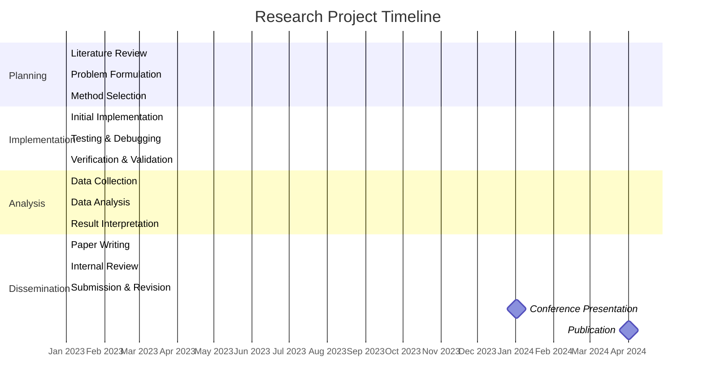

# Research Process in Computational Physics

This document illustrates the typical research process in our computational physics group.
These visual guides will help you understand the workflow and methodologies we use.

## Overall Research Workflow

## Computational Method Development Cycle

## Publication Workflow

## Verification and Validation Process

## Data Analysis Pipeline

```mermaid
flowchart LR
    subgraph Simulation["Simulation"]
        Config[Configuration] --> Run[Simulation Run]
        Run --> RawData[Raw Data]
    end
    
    subgraph Processing["Data Processing"]
        RawData --> Filtering[Filtering & Cleaning]
        Filtering --> Transform[Transformations]
        Transform --> Feature[Feature Extraction]
    end
    
    subgraph Analysis["Analysis"]
        Feature --> Visualization[Visualization]
        Visualization --> Statistics[Statistical Analysis]
        Statistics --> ML[Machine Learning/Pattern Recognition]
    end
    
    subgraph Interpretation["Interpretation"]
        ML --> Compare[Comparison with Theory]
        Compare --> Insights[Physical Insights]
        Insights --> Conclusions[Conclusions]
    end
    
    style Simulation fill:#d5e5f9,stroke:#333,stroke-width:2px
    style Processing fill:#f9d5e5,stroke:#333,stroke-width:2px
    style Analysis fill:#e5f9d5,stroke:#333,stroke-width:2px
    style Interpretation fill:#f9e5d5,stroke:#333,stroke-width:2px
```

## Collaborative Research Model

## Problem-Solving Approach

## Computational Physics Research Areas

## Typical Project Timeline

## Using These Diagrams

These diagrams provide visual guides to our research processes. They are meant to:

1. **Clarify expectations**: Understand the steps involved in research projects
2. **Provide structure**: Follow established workflows for efficiency
3. **Enable planning**: Anticipate upcoming phases of your research
4. **Facilitate communication**: Use common terminology and process understanding

Remember that real research is often non-linear and iterative. These diagrams represent idealized processes that will need to be adapted to specific research challenges. 